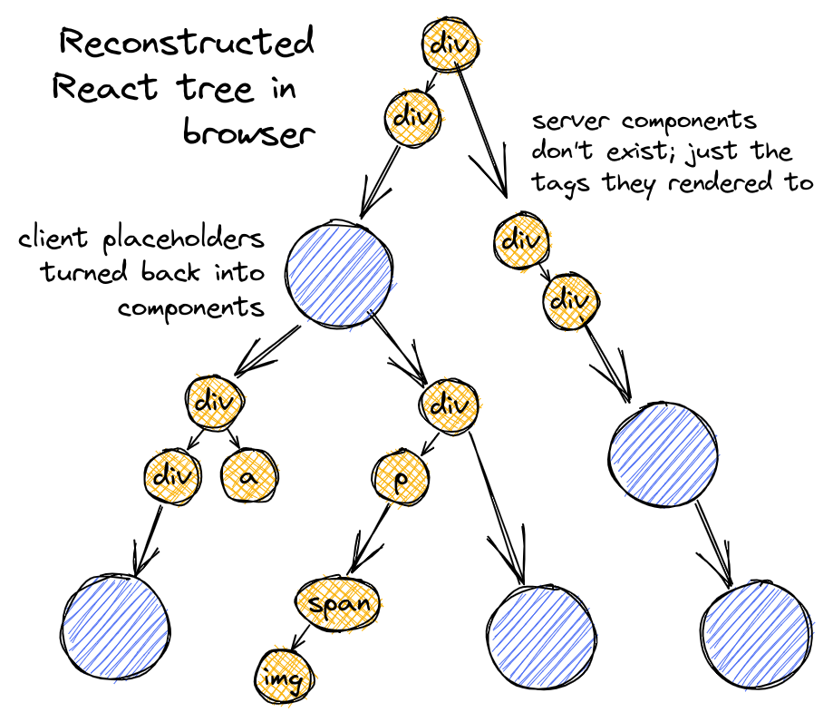

**CSR**：Client Side Rendering（客户端渲染）

客户端渲染是目前网页最常见的渲染方式。在客户端渲染中，服务器发送一个初始的 HTML 文件和一些 JS 文件给浏览器。这个 HTML 文件通常只包含一个空的根元素，例如 `

`，然后 JS 会在浏览器中生成完整的网页内容并插入到这个根元素中。

由于客户端渲染的页面内容是由 JS 控制的，因此无法在 Dev Tools 里预览 HTML 文档的结构。

CSR 在首次渲染的时候会加载大量的 JS 等文件，会造成首屏渲染时间稍长，且客户端渲染需要考虑不同用户不同版本浏览器对新特性的兼容程度。

适合对首屏时间不敏感但重交互的后台管理类应用。

---
**SSR**：Server Side Rendering（服务端渲染）

对比客户端渲染，服务端渲染就是在服务端生成完整的静态 HTML 页面，然后发送给浏览器。

然后，浏览器会加载并执行 JS 文件，为静态 DOM 添加事件监听器等，使其具有交互能力。

> 给 DOM 添加事件监听器等，使其具有交互能力过程称为"水合"（Hydration）。

SSR 对比 CSR 首屏不需要加载大量的静态文件，服务器直接返回可预览的 HTML 页面，因此 SSR 对于 SEO 更加友好。

适合官网或 Web APP 这类对首屏加载时间敏感且兼具交互性的应用。

---
**SSG**：Static Site Generation（静态站点生成）

在一定程度上 SSG 可被视为一种 SSR。SSG 和 SSR 都是在服务器端生成 HTML 内容。它们的区别在于“何时”生成 HTML。在服务端渲染中，HTML 内容是在服务端接收到请求后实时生成并返回给浏览器的。而在静态站点生成中，所有的 HTML 内容都是在构建阶段完成的。

SSG 非常适合博客或者技术文档类项目。

---

**RSC**：React Server Component（服务端组件）和 **CSC**：Client Side Component（客户端组件）

客户端组件和服务端组件其实都是服务端渲染的，它们在服务端生成静态 HTML，然后被序列化之后发送给浏览器。如下图所示，服务端组件在 React Tree 里是静态 HTML 标签，而客户端组件则使用 `客户端组件占位符` 占位。

注意：客户端组件里的某些元素实际上并不依赖客户端环境，这部分会通过服务端渲染完整 HTML。而有些客户端组件元素是依赖客户端环境的，因此这些元素在服务器只是渲染了一个初始 HTML，甚至不渲染，那么这部分则需要在客户端进行复苏。

浏览器接收到序列化 React Tree 之后对其进行反序列化，复苏 `客户端组件占位符`，并呈现最终结果。

推荐阅读：

[How React server components work: an in-depth guide](https://www.plasmic.app/blog/how-react-server-components-work)

[Introducing Zero-Bundle-Size React Server Components](https://react.dev/blog/2020/12/21/data-fetching-with-react-server-components)
